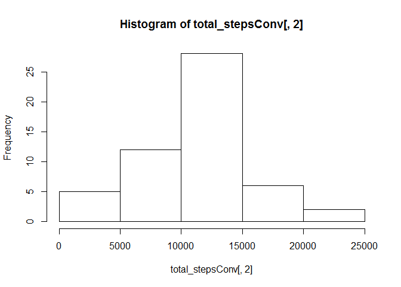
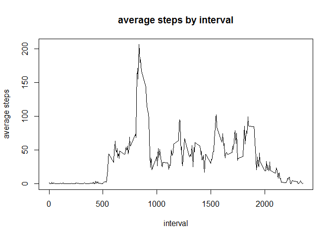
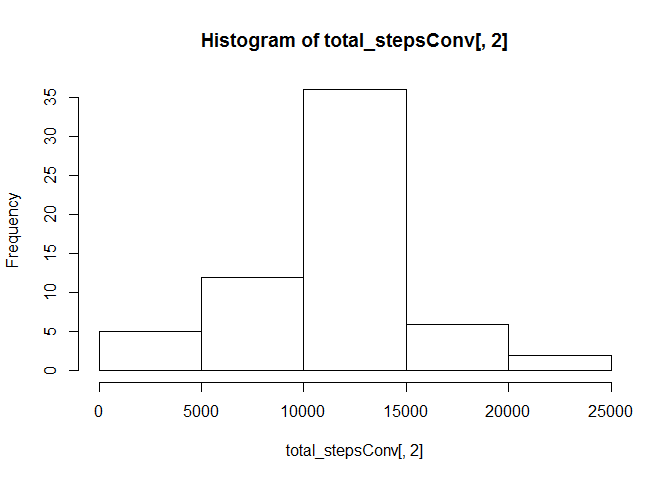
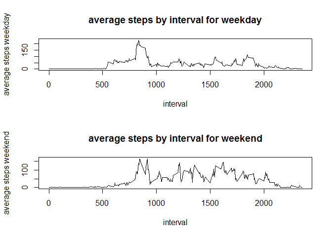

# Reproducible Research: Peer Assessment 1


## Loading and preprocessing the data

```r
#read the actvity file into R
activity <- read.csv("activity.csv", header = TRUE, sep = ",")

library(dplyr)
```

```
## Warning: package 'dplyr' was built under R version 3.2.3
```

```
## 
## Attaching package: 'dplyr'
```

```
## The following objects are masked from 'package:stats':
## 
##     filter, lag
```

```
## The following objects are masked from 'package:base':
## 
##     intersect, setdiff, setequal, union
```

```r
#subset to 2 column, group and remove nas
steps_day <- na.omit(group_by(select(activity,-interval),date))

#calculate total steps by day and summarise by date
total_steps <- summarise_each(steps_day,funs(sum))

#convert column to numeric
total_stepsConv <- transform(total_steps, date = as.numeric(date), steps = as.numeric(steps))

#histtogram plot of total steps per day
hist(total_stepsConv[,2])
```



## What is mean total number of steps taken per day?

```r
#read the actvity file into R
activity <- read.csv("activity.csv", header = TRUE, sep = ",")

library(dplyr)

#subset to 2 column, group and remove nas
steps_day <- na.omit(group_by(select(activity,-interval),date))

#calculate total steps by day and summarise by date
total_steps <- summarise_each(steps_day,funs(sum))

#convert column to numeric
total_stepsConv <- transform(total_steps, date = as.numeric(date), steps = as.numeric(steps))

#histtogram plot of total steps per day
hist(total_stepsConv[,2])
```


```r
#Calculate and report the mean and median of the total number of steps taken per day
mean(total_stepsConv[,2])
```

```
## [1] 10766.19
```

```r
median(total_stepsConv[,2])
```

```
## [1] 10765
```
## What is the average daily activity pattern?

```r
#read the actvity file into R
activity <- read.csv("activity.csv", header = TRUE, sep = ",")

library(dplyr)

#subset 2 column, group and remove na's
steps_interval <- na.omit(group_by(select(activity,-date),interval))


#calculate average steps by interval accross all day
average_steps <- summarise_each(steps_interval,funs(mean))

#plotting average steps by interval
plot.ts(average_steps$interval,average_steps$steps, main = "average steps by interval", xlab = "interval", ylab = "average steps", type = "l")
```



```r
# computing interval with max average steps across all days
max_avg_steps <- subset(average_steps,average_steps$steps==max(average_steps$steps))
as.numeric((apply(is.na(activity),2,sum))[1])                       
```

```
## [1] 2304
```


## Imputing missing values


```r
#read the actvity file into R
activity <- read.csv("activity.csv", header = TRUE, sep = ",")

library(dplyr)

#computing number of rows with Nas
apply(is.na(activity),2,sum)
```

```
##    steps     date interval 
##     2304        0        0
```

```r
#The strategy choose here is to replace missing values by the interval average accross all days

#subset 2 column, group and remove na's
steps_interval <- na.omit(group_by(select(activity,-date),interval))


#calculate average steps by interval accross all day
average_steps <- summarise_each(steps_interval,funs(mean))

# subsseting missing values in activity data frame 
mis_value <- activity[is.na(activity),]

#for each missing value in an interval, looking for the corresponding #interval in average_steps data and replace by the step for that #interval in average_steps data frame
for (i in seq(1, length(mis_value[,1]), by = 1)){
  for (j in seq(1, dim(average_steps[,1])[1], by = 1)){
    
      if (mis_value[i,3] == average_steps[j,1]){
      mis_value[i,1] <- average_steps[j,2]
      } 
    
  } 
  
}
head(mis_value)
```

```
##       steps       date interval
## 1 1.7169811 2012-10-01        0
## 2 0.3396226 2012-10-01        5
## 3 0.1320755 2012-10-01       10
## 4 0.1509434 2012-10-01       15
## 5 0.0754717 2012-10-01       20
## 6 2.0943396 2012-10-01       25
```

```r
activity[is.na(activity),] <- mis_value
head(activity)
```

```
##       steps       date interval
## 1 1.7169811 2012-10-01        0
## 2 0.3396226 2012-10-01        5
## 3 0.1320755 2012-10-01       10
## 4 0.1509434 2012-10-01       15
## 5 0.0754717 2012-10-01       20
## 6 2.0943396 2012-10-01       25
```

```r
new_activity <- activity

#Make a histogram of the total number of steps taken each day and #Calculate and report the mean and median total number of steps taken #per day. Do these values differ from the estimates from the first part #of the assignment? What is the impact of imputing missing data on the #estimates of the total daily number of steps?
 
#subset to 2 column, group and remove nas
steps_day <- (group_by(select(activity,-interval),date))

#calculate total steps by day and summarise by date
total_steps <- summarise_each(steps_day,funs(sum))

#convert column to numeric
total_stepsConv <- transform(total_steps, date = as.numeric(date), steps = as.numeric(steps))

#histtogram plot of total steps per day
hist(total_stepsConv[,2])
```



```r
#Calculate and report the mean and median of the total number of steps taken per day
mean(total_stepsConv[,2])
```

```
## [1] 10766.19
```

```r
median(total_stepsConv[,2])
```

```
## [1] 10766.19
```
Yes the values differ, by omitting missing data the mean and median differ

## Are there differences in activity patterns between weekdays and weekends?

```r
#read the actvity file into R
activity <- read.csv("activity.csv", header = TRUE, sep = ",")

library(dplyr)
#subset 2 column, group and remove na's
steps_interval <- na.omit(group_by(select(activity,-date),interval))


#calculate average steps by interval accross all day
average_steps <- summarise_each(steps_interval,funs(mean))

# subsseting missing values in activity data frame 
mis_value <- activity[is.na(activity),]

#for each missing value in an interval, looking for the corresponding #interval in #average_steps data and replace by the step for that #interval in average_steps data #frame
for (i in seq(1, length(mis_value[,1]), by = 1)){
  for (j in seq(1, dim(average_steps[,1])[1], by = 1)){
    
      if (mis_value[i,3] == average_steps[j,1]){
      mis_value[i,1] <- average_steps[j,2]
      } 
    
  } 
  
}
head(mis_value)
```

```
##       steps       date interval
## 1 1.7169811 2012-10-01        0
## 2 0.3396226 2012-10-01        5
## 3 0.1320755 2012-10-01       10
## 4 0.1509434 2012-10-01       15
## 5 0.0754717 2012-10-01       20
## 6 2.0943396 2012-10-01       25
```

```r
activity[is.na(activity),] <- mis_value
head(activity)
```

```
##       steps       date interval
## 1 1.7169811 2012-10-01        0
## 2 0.3396226 2012-10-01        5
## 3 0.1320755 2012-10-01       10
## 4 0.1509434 2012-10-01       15
## 5 0.0754717 2012-10-01       20
## 6 2.0943396 2012-10-01       25
```

```r
new_activity <- activity

day_activity <- mutate(new_activity, day = weekdays(as.POSIXct(date)))
day_activity$weeksday <- ifelse(day_activity$day %in% c("Saturday", "Sunday") ,"weekday", "weekend")

data <- select(day_activity,-day)

#subset  column, and group 
steps_interval <- (group_by(select(data,-date),interval))
steps_interval_new <- steps_interval[steps_interval$weeksday== "weekend",]
steps_interval_new1 <- steps_interval[steps_interval$weeksday== "weekday",]

#calculate average steps by interval accross all weekend
average_steps <-summarize_each(select(steps_interval_new, -weeksday), funs(mean))

#calculate average steps by interval accross all weekday
average_steps1 <- summarize_each(select(steps_interval_new1, -weeksday), funs(mean))

par(mfrow =c(2,1))

#plotting average steps by interval for weekday
plot.ts(average_steps$interval,average_steps$steps, main = "average steps by interval for weekday", xlab = "interval", ylab = "average steps weekday", type = "l")

#plotting average steps by interval accross all weekend
plot.ts(average_steps1$interval,average_steps1$steps, main = "average steps by interval for weekend", xlab = "interval", ylab = "average steps weekend", type = "l")
```



